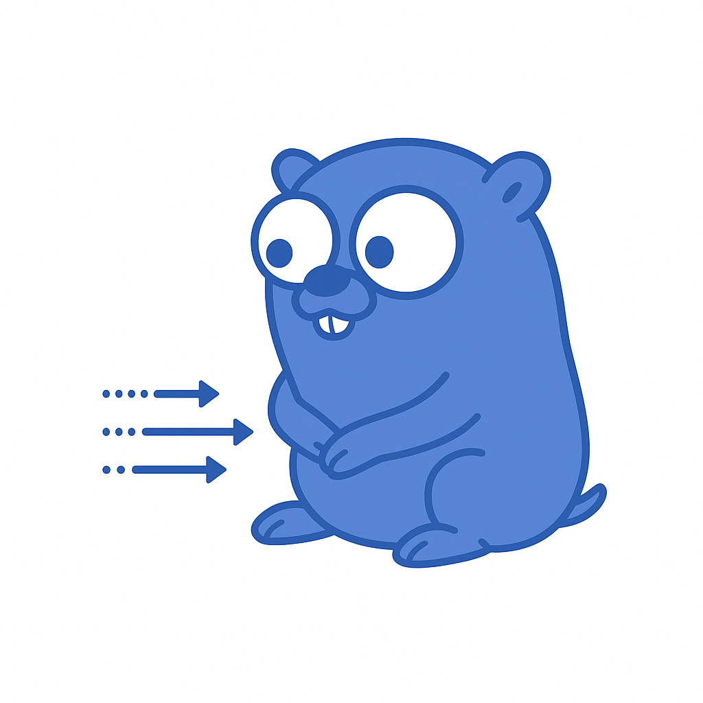

# ydbconsumer

<p align="left">
    
</p>

**ydbconsumer** is a simple Go application for reading messages from a [YDB](https://ydb.tech/) Topic.  
It connects over GRPCS, reads batches of messages, prints them, and commits their offsets.

---

## Features

- GRPCS connection to YDB
- Batch reading from YDB Topic
- Message metadata and body printed to stdout
- Automatic commit of received messages
- Graceful shutdown on Ctrl+C / SIGTERM
- Configurable via flags

---

## ⚙️ Usage

```bash
go run main.go \
  -endpoint "localhost:2135" \
  -database "/local" \
  -user "root" \
  -password "password" \
  -ca_file "./ydb_certs/ca.crt" \
  -topic "/my/topic" \
  -consumer "debug-consumer" \
  -batch_size 100 \
  -read_timeout 5s
